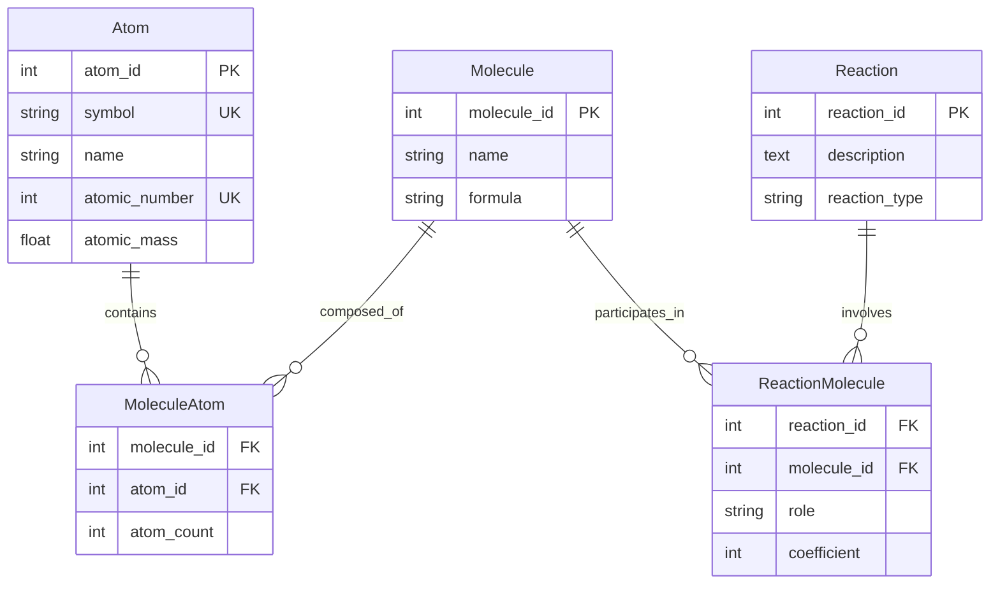
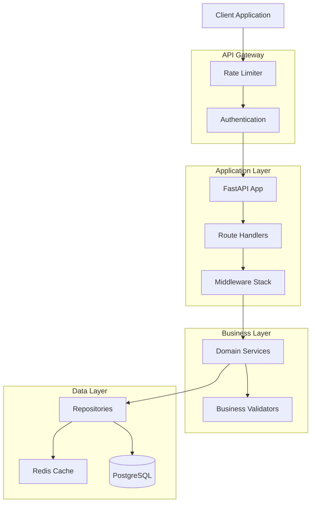

# Architecture Analysis: FastAPI Chemistry Database API

## Executive Summary

This document provides a comprehensive architectural analysis of the ChemAPI project - a FastAPI-based chemistry database API for managing atoms, molecules, and chemical reactions. The analysis evaluates the current implementation against industry best practices and provides actionable recommendations for improvement.

## 1. Overall Project Structure Analysis

### Current Structure
```
FapiVuln/
├── main.py                 # Application entry point
├── database.py             # Database configuration
├── models.py               # SQLAlchemy ORM models
├── schemas.py              # Pydantic validation schemas
├── requirements.txt        # Dependencies
├── test_crud.py           # CRUD tests
├── test_main.http         # HTTP test file
├── chimie.db              # SQLite database
├── routers/               # API route handlers
│   ├── __init__.py
│   └── atoms.py           # Atom endpoints
└── data_sample/           # Sample data
    ├── *.csv              # CSV data files
    └── chimie_script_for_db.py
```

### Strengths
- ✅ Clear separation between models, schemas, and routes
- ✅ Use of modern Python frameworks (FastAPI, SQLAlchemy 2.0+, Pydantic 2.0+)
- ✅ Basic modular structure with routers directory

### Weaknesses
- ❌ Flat project structure - lacks proper layering
- ❌ Missing service/repository layers
- ❌ No clear separation of concerns (business logic mixed with routes)
- ❌ Configuration management using decouple but DATABASE_URL hardcoded fallback
- ❌ Missing .env example file
- ❌ No logging configuration
- ❌ Database file (chimie.db) committed to repository

### Recommendations
1. **Adopt a layered architecture:**
```
src/
├── api/
│   ├── v1/
│   │   ├── endpoints/
│   │   ├── dependencies/
│   │   └── middleware/
├── core/
│   ├── config.py
│   ├── security.py
│   └── logging.py
├── domain/
│   ├── models/
│   ├── schemas/
│   └── exceptions/
├── infrastructure/
│   ├── database/
│   └── repositories/
├── services/
└── tests/
```

## 2. Database Design and ORM Implementation

### Current Design

#### Entity Relationships


### Strengths
- ✅ Proper normalization with junction tables
- ✅ Use of relationships in SQLAlchemy models
- ✅ Appropriate constraints (unique, foreign keys)
- ✅ Check constraint on reaction role

### Weaknesses
- ❌ Duplicate Base declaration in models.py
- ❌ No database migrations (Alembic)
- ❌ Missing indexes on frequently queried fields
- ❌ No soft delete mechanism
- ❌ No audit fields (created_at, updated_at)
- ❌ Hardcoded role values in French ('réactif', 'produit')

### Recommendations
1. **Implement Alembic for migrations**
2. **Add base model with common fields:**
```python
class BaseModel(Base):
    __abstract__ = True
    
    created_at = Column(DateTime, default=datetime.utcnow)
    updated_at = Column(DateTime, default=datetime.utcnow, onupdate=datetime.utcnow)
    is_deleted = Column(Boolean, default=False)
```

3. **Add composite indexes:**
```python
__table_args__ = (
    Index('idx_molecule_name_formula', 'name', 'formula'),
    Index('idx_reaction_type', 'reaction_type'),
)
```

## 3. API Design Patterns and REST Conventions

### Current Implementation

#### Endpoint Analysis
- `/api/v1/atoms` - GET, PUT, DELETE operations
- Missing POST endpoint for atom creation
- Inconsistent response models
- No API versioning strategy beyond URL prefix

### Strengths
- ✅ Use of FastAPI's automatic documentation
- ✅ Response model validation
- ✅ Query parameter validation with Query()

### Weaknesses
- ❌ Incomplete CRUD operations (missing POST for atoms)
- ❌ No consistent error response format
- ❌ Missing pagination metadata in responses
- ❌ No HATEOAS implementation
- ❌ Missing routers for molecules, reactions
- ❌ No batch operations support

### Recommendations
1. **Implement complete CRUD for all entities**
2. **Standardize response format:**
```python
class StandardResponse(BaseModel):
    success: bool
    data: Optional[Any] = None
    error: Optional[str] = None
    metadata: Optional[dict] = None
```

3. **Add pagination wrapper:**
```python
class PaginatedResponse(BaseModel):
    items: List[Any]
    total: int
    page: int
    size: int
    pages: int
```

## 4. Error Handling and Validation

### Current State
- Basic HTTPException usage
- Pydantic validation on schemas
- Manual uniqueness checks in update operations

### Weaknesses
- ❌ No global exception handler
- ❌ No custom exception classes
- ❌ Inconsistent error messages
- ❌ No request ID tracking
- ❌ Database errors exposed to clients

### Recommendations
1. **Implement global exception handler:**
```python
@app.exception_handler(Exception)
async def global_exception_handler(request: Request, exc: Exception):
    logger.error(f"Unhandled exception: {exc}", exc_info=True)
    return JSONResponse(
        status_code=500,
        content={"detail": "Internal server error", "request_id": request.state.request_id}
    )
```

2. **Create domain-specific exceptions:**
```python
class ChemAPIException(Exception):
    pass

class AtomNotFoundException(ChemAPIException):
    pass

class DuplicateAtomException(ChemAPIException):
    pass
```

## 5. Testing Approach

### Current Testing
- Basic CRUD tests in test_crud.py
- HTTP test file (test_main.http)
- Pytest fixtures for database sessions

### Strengths
- ✅ Use of pytest fixtures
- ✅ Test isolation with function-scoped sessions
- ✅ Comprehensive CRUD coverage

### Weaknesses
- ❌ No unit tests (only integration tests)
- ❌ No API endpoint tests
- ❌ Missing test configuration
- ❌ No test coverage reporting
- ❌ No performance tests
- ❌ No mock/stub usage

### Recommendations
1. **Separate test types:**
```
tests/
├── unit/
├── integration/
├── e2e/
└── performance/
```

2. **Add pytest configuration:**
```ini
# pytest.ini
[tool.pytest.ini_options]
testpaths = ["tests"]
python_files = ["test_*.py"]
addopts = "--cov=src --cov-report=html --cov-report=term"
```

## 6. Security Considerations

### Current Security Posture
- CORS enabled with wildcard origins
- No authentication/authorization
- No rate limiting
- No input sanitization beyond Pydantic

### Critical Security Issues
- 🔴 **CORS allows all origins** - Major security risk
- 🔴 **No authentication** - API is completely open
- 🔴 **No rate limiting** - Vulnerable to DoS
- 🔴 **SQL injection risk** - Using string formatting in filters
- 🔴 **No API key management**
- 🔴 **No HTTPS enforcement**

### Recommendations
1. **Implement authentication:**
```python
from fastapi.security import OAuth2PasswordBearer, HTTPBearer

security = HTTPBearer()

async def get_current_user(credentials: HTTPAuthorizationCredentials = Security(security)):
    # Validate token
    pass
```

2. **Configure CORS properly:**
```python
app.add_middleware(
    CORSMiddleware,
    allow_origins=["https://yourfrontend.com"],
    allow_credentials=True,
    allow_methods=["GET", "POST", "PUT", "DELETE"],
    allow_headers=["Authorization", "Content-Type"],
)
```

3. **Add rate limiting:**
```python
from slowapi import Limiter
limiter = Limiter(key_func=get_remote_address)
app.state.limiter = limiter
```

## 7. Performance and Scalability

### Current Performance Characteristics
- SQLite database (not suitable for production)
- No caching layer
- No query optimization
- Synchronous operations only

### Bottlenecks
- ❌ SQLite limits concurrent writes
- ❌ No connection pooling configuration
- ❌ N+1 query problems possible
- ❌ No lazy loading strategy
- ❌ Missing database indexes

### Recommendations
1. **Switch to PostgreSQL for production**
2. **Implement caching:**
```python
from fastapi_cache import FastAPICache
from fastapi_cache.backend.redis import RedisBackend

@app.on_event("startup")
async def startup():
    redis = aioredis.from_url("redis://localhost")
    FastAPICache.init(RedisBackend(redis), prefix="chemapi-cache:")
```

3. **Add async support:**
```python
from sqlalchemy.ext.asyncio import AsyncSession, create_async_engine
```

## 8. Code Quality and Maintainability

### Positive Aspects
- ✅ Type hints usage
- ✅ Docstrings in French (consistent)
- ✅ Modern Python features

### Issues
- ❌ Mixed languages (French comments, English code)
- ❌ No code formatting standard (black, isort)
- ❌ No linting configuration
- ❌ Magic numbers and strings
- ❌ No dependency injection pattern
- ❌ Business logic in routers

### Recommendations
1. **Add pre-commit hooks:**
```yaml
# .pre-commit-config.yaml
repos:
  - repo: https://github.com/psf/black
    rev: 23.0.0
    hooks:
      - id: black
  - repo: https://github.com/PyCQA/flake8
    rev: 6.0.0
    hooks:
      - id: flake8
```

2. **Extract business logic to services:**
```python
class AtomService:
    def __init__(self, repository: AtomRepository):
        self.repository = repository
    
    async def get_atom_by_symbol(self, symbol: str) -> Atom:
        # Business logic here
        pass
```

## 9. Missing Components

### Critical Missing Features
1. **No API documentation beyond auto-generated**
2. **No health check endpoint with dependencies**
3. **No metrics/monitoring integration**
4. **No Docker configuration**
5. **No CI/CD pipeline**
6. **Missing routers for Molecule and Reaction entities**
7. **No data validation for chemical formulas**
8. **No bulk import/export functionality**

## 10. Recommended Architecture

### Target Architecture


## 11. Implementation Roadmap

### Phase 1: Critical Security & Structure (Week 1-2)
- Implement authentication/authorization
- Fix CORS configuration
- Add rate limiting
- Restructure project with proper layers
- Add environment configuration

### Phase 2: Database & API Completion (Week 3-4)
- Migrate to PostgreSQL
- Implement Alembic migrations
- Complete CRUD for all entities
- Add proper error handling
- Implement logging

### Phase 3: Quality & Testing (Week 5-6)
- Add comprehensive test suite
- Implement CI/CD pipeline
- Add code quality tools
- Create API documentation

### Phase 4: Performance & Monitoring (Week 7-8)
- Add caching layer
- Implement async operations
- Add monitoring/metrics
- Performance optimization
- Load testing

## 12. Alternative Approaches

### Alternative 1: Microservices Architecture
**Pros:**
- Better scalability
- Technology flexibility
- Independent deployment

**Cons:**
- Increased complexity
- Network overhead
- Requires service mesh

**Verdict:** Not recommended for current scale

### Alternative 2: GraphQL Instead of REST
**Pros:**
- Flexible queries
- Reduced over-fetching
- Strong typing

**Cons:**
- Learning curve
- Complex caching
- N+1 query problems

**Verdict:** Consider for future if complex queries needed

### Alternative 3: Event-Driven Architecture
**Pros:**
- Loose coupling
- Better scalability
- Async processing

**Cons:**
- Complexity
- Eventual consistency
- Debugging challenges

**Verdict:** Overkill for current requirements

## Conclusion

The ChemAPI project has a solid foundation with modern technology choices but requires significant improvements in security, architecture, and production readiness. The highest priorities should be:

1. **Security fixes** (authentication, CORS, rate limiting)
2. **Architectural restructuring** (proper layering, separation of concerns)
3. **Database migration** (PostgreSQL, Alembic)
4. **API completion** (missing endpoints, error handling)
5. **Testing and quality** (comprehensive tests, CI/CD)

The recommended approach is to follow the phased implementation roadmap, focusing on critical security issues first, then gradually improving the architecture while maintaining backward compatibility.